# Deckard 🎭

> **Voice and Likeness Clone** - A real-time AI avatar platform combining voice conversation, sentiment analysis, and video generation to create lifelike digital personas.

---

## Overview

Deckard is an advanced AI platform that creates personalized avatar clones capable of real-time voice conversations. The system combines OpenAI's Realtime API, sentiment-driven mood dynamics, and lip-synced video generation (via D-ID) to deliver an immersive conversational experience.

### Key Features

- **Real-time Voice Conversations** - Seamless audio streaming with 24kHz PCM quality
- **Sentiment-Aware Personas** - Dynamic mood changes based on conversation tone
- **Multi-Agent AI System** - Coordinated specialists for web search, sentiment analysis, and browser automation
- **Lip-Synced Video Generation** - D-ID integration for realistic talking avatar videos
- **Computer Use Capability** - Browser automation for web research and expert search
- **Image Analysis** - Upload and discuss images within conversations
- **Three Unique Personas** - Joi, Officer K, and Officer J with distinct voices and personalities

---

## System Architecture


---

## Technology Stack

### Backend
- **Framework**: FastAPI with WebSocket support
- **Language**: Python 3.12+
- **Package Manager**: uv
- **Key Libraries**:
  - `openai-agents[voice]` - OpenAI Agents SDK for realtime conversation
  - `fastapi` & `uvicorn` - Web framework and ASGI server
  - `websockets` - Real-time bidirectional communication
  - `playwright` - Browser automation for computer use
  - `supabase` - Database client

### Frontend
- **Framework**: Next.js 15.5 with React 19
- **Language**: TypeScript 5
- **Styling**: Tailwind CSS 4
- **Database**: Supabase client with SSR support
- **Testing**: Playwright for E2E tests

### Infrastructure
- **Database**: Supabase (PostgreSQL + pgvector)
- **AI Services**: OpenAI API (GPT-5, Realtime API)
- **Video Generation**: D-ID Talks API
- **Planned GPU**: RunPod (for EchoMimic v3 voice cloning)

---

## Quick Start

### Prerequisites
- Python 3.12+
- Node.js 18+
- Supabase account
- OpenAI API key
- D-ID API key

### Server Setup

```bash
cd server

# Install dependencies using uv
pip install uv
uv pip install -e .

# Configure environment
cp .env.example .env
# Edit .env with your API keys

# Run development server
uvicorn app.main:app --reload --host 0.0.0.0 --port 8000
```

### Web Setup

```bash
cd web

# Install dependencies
npm install

# Configure environment
cp .env.example .env.local
# Edit .env.local with your Supabase keys

# Run database migrations
supabase db reset --db-url "$SUPABASE_DB_URL"

# Run development server
npm run dev
```

Visit `http://localhost:3000` to access the application.

---

## Real-time Conversation Flow

```mermaid
sequenceDiagram
    participant User
    participant Browser
    participant WebSocket
    participant Server
    participant OpenAI
    participant Sentiment
    participant D-ID

    User->>Browser: Start conversation
    Browser->>WebSocket: Connect (ws://localhost:8000)
    WebSocket->>Server: Establish session
    Server->>OpenAI: Initialize RealtimeSession
    Server->>Browser: persona_mood_update (initial)

    loop Conversation
        User->>Browser: Speaks into microphone
        Browser->>WebSocket: Audio chunks (PCM 24kHz)
        WebSocket->>Server: Forward audio
        Server->>OpenAI: Stream audio input

        OpenAI->>Server: Response audio + text
        Server->>Server: Buffer audio chunks

        par Sentiment Analysis
            Server->>Sentiment: Classify user message
            Sentiment-->>Server: Sentiment (positive/negative/neutral)
            Server->>Browser: persona_mood_update
        end

        par Video Generation
            Server->>D-ID: Generate lip-sync video
            Note over D-ID: Audio → WAV conversion<br/>Image + Audio/Text → Video
            D-ID-->>Server: Video URL
        end

        Server->>Browser: Audio stream + Video URL
        Browser->>User: Play audio & display video
    end

    User->>Browser: End conversation
    Browser->>WebSocket: Disconnect
    Server->>OpenAI: Close session
```



---

## Multi-Agent System

```mermaid
graph TD
    USER[User Query] --> MAIN[Realtime Voice<br/>Assistant Agent<br/>GPT-5]

    MAIN -->|Needs current info| WEB_SEARCH[Web Search Agent<br/>GPT-5 + SearchTool]
    MAIN -->|Every message| SENTIMENT_CLASSIFY[Sentiment Classifier<br/>GPT-5-mini]
    MAIN -->|Browser automation| COMPUTER_USE[Computer Use Agent<br/>Playwright]

    WEB_SEARCH -->|Search results| MAIN
    WEB_SEARCH -->|Handoff back| MAIN

    SENTIMENT_CLASSIFY -->|positive/negative/neutral| MOOD_UPDATE[Persona Mood Update]
    MOOD_UPDATE -->|Select video| VIDEO_MAP{Mood → Video}

    VIDEO_MAP -->|positive| HAPPY["/persona-happy.mp4"]
    VIDEO_MAP -->|negative| SAD["/persona-sad.mp4"]
    VIDEO_MAP -->|neutral| THINKING["/persona-thinking.mp4"]

    COMPUTER_USE -->|Expert search| ADVICEHUB[AdviceHub.ai Search]
    COMPUTER_USE -->|Generic browse| GOOGLE[Google Search + Extract]

    ADVICEHUB -->|Expert info| MAIN
    GOOGLE -->|Web content| MAIN

    MAIN --> RESPONSE[Voice Response<br/>+ Video Generation]
    RESPONSE --> USER

    style MAIN fill:#4A90E2,stroke:#2E5C8A,color:#fff
    style WEB_SEARCH fill:#10B981,stroke:#059669,color:#fff
    style SENTIMENT_CLASSIFY fill:#F59E0B,stroke:#D97706,color:#fff
    style COMPUTER_USE fill:#8B5CF6,stroke:#7C3AED,color:#fff
    style MOOD_UPDATE fill:#EC4899,stroke:#DB2777,color:#fff
    style RESPONSE fill:#06B6D4,stroke:#0891B2,color:#fff
```



---

## Database Schema


---

## Sentiment-Driven Mood System


---

## Persona System

Deckard includes three distinct AI personas, each with unique voice characteristics and visual moods:

### Joi (Default)
- **Voice**: `en-US-AriaNeural` - Sophisticated, warm female voice
- **Character**: Empathetic, thoughtful, engaging
- **Videos**: `joi-happy.mp4`, `joi-sad.mp4`, `joi-thinking.mp4`

### Officer K
- **Voice**: `en-US-GuyNeural` - Deep, authoritative male voice
- **Character**: Professional, direct, analytical
- **Videos**: `officer_k-happy.mp4`, `officer_k-sad.mp4`, `officer_k-thinking.mp4`

### Officer J
- **Voice**: `en-US-JennyNeural` - Clear, professional female voice
- **Character**: Efficient, precise, helpful
- **Videos**: `officer_j-happy.mp4`, `officer_j-sad.mp4`, `officer_j-thinking.mp4`

Each persona dynamically switches mood videos based on sentiment analysis of the conversation.

---

## Project Structure

```
deckard/
├── server/                          # FastAPI backend
│   ├── app/
│   │   ├── main.py                 # WebSocket server & session manager
│   │   ├── config.py               # Environment configuration
│   │   ├── ai_agents/              # AI agent implementations
│   │   │   ├── realtime_conversation.py
│   │   │   ├── web_search_agent.py
│   │   │   ├── sentiment_classifying.py
│   │   │   └── ...
│   │   ├── services/               # External service integrations
│   │   │   ├── did_talks.py        # D-ID video generation
│   │   │   ├── computer_use.py     # Browser automation
│   │   │   ├── web_search.py
│   │   │   └── ...
│   │   ├── models/
│   │   │   └── schemas.py          # Pydantic models
│   │   └── routers/                # API routes
│   ├── tests/                      # Backend tests
│   ├── pyproject.toml              # Python dependencies
│   └── .env.example
│
├── web/                            # Next.js frontend
│   ├── src/
│   │   ├── app/
│   │   │   ├── page.tsx            # Main conversation UI
│   │   │   ├── layout.tsx
│   │   │   └── api/                # API routes
│   │   ├── components/             # React components
│   │   ├── hooks/                  # Custom React hooks
│   │   └── lib/
│   │       └── supabase/           # Database utilities
│   ├── supabase/
│   │   └── migrations/
│   │       └── 0001_init.sql       # Database schema
│   ├── public/                     # Static assets
│   │   ├── joi.png                 # Persona portraits
│   │   ├── joi-happy.mp4           # Mood videos (9 total)
│   │   └── ...
│   ├── tests/                      # E2E tests
│   ├── package.json
│   └── .env.example
│
├── docs/                           # Documentation
│   ├── plan/
│   └── notes/
│
├── AGENTS.md                       # Agent development guidelines
└── README.md
```

---

## Environment Configuration

### Server Environment (.env)

```bash
# Required - AI APIs
OPENAI_API_KEY=sk-...                    # OpenAI API key
DID_API_KEY=username:password            # D-ID Talks API credentials

# Optional - D-ID Source URLs (enables text-based generation)
DID_SOURCE_URL_JOI=https://...           # Public URL to Joi image
DID_SOURCE_URL_OFFICER_K=https://...     # Public URL to Officer K image
DID_SOURCE_URL_OFFICER_J=https://...     # Public URL to Officer J image
DID_WEBHOOK_URL=https://...              # Webhook for video completion

# Required - Database
SUPABASE_URL=https://...                 # Supabase project URL
SUPABASE_SERVICE_ROLE_KEY=...            # Admin access key

# Optional - Infrastructure
RUNPOD_BASE_URL=https://...              # Planned GPU infrastructure
LOG_LEVEL=INFO                           # Logging verbosity

# Optional - Playwright
PLAYWRIGHT_HEADLESS=true                 # Headless browser mode
PLAYWRIGHT_USER_DATA_DIR=./browser-data  # Browser profile persistence
COMPUTER_USE_MAX_TURNS=25                # Maximum automation steps
```

### Web Environment (.env.local)

```bash
# Required - Supabase
NEXT_PUBLIC_SUPABASE_URL=https://...            # Supabase project URL
NEXT_PUBLIC_SUPABASE_ANON_KEY=...               # Public anon key
SUPABASE_SERVICE_ROLE_KEY=...                   # Server-only admin key
SUPABASE_JWT_SECRET=...                         # JWT verification

# Optional - WebSocket
NEXT_PUBLIC_REALTIME_WS_URL=ws://localhost:8000 # WebSocket endpoint
```

---

## Development Workflow

### Running Tests

**Backend Tests**:
```bash
cd server
pytest
```

**Frontend E2E Tests**:
```bash
cd web
npx playwright test
npx playwright test --ui  # Interactive mode
```

### Code Quality

**Backend Linting**:
```bash
cd server
ruff check .
```

**Frontend Linting**:
```bash
cd web
npm run lint
```

### Database Migrations

```bash
cd web
supabase db reset --db-url "$SUPABASE_DB_URL"
```

---

## WebSocket API

### Connection
```
ws://localhost:8000/realtime/ws?persona={persona_name}
```

### Client → Server Messages

**Audio Streaming**:
```json
{
  "type": "audio",
  "audio": "base64_encoded_pcm_data"
}
```

**Image Upload**:
```json
{
  "type": "image",
  "image": "base64_encoded_image",
  "prompt": "What do you see in this image?"
}
```

**Microphone Control**:
```json
{
  "type": "client_event",
  "event": "microphone_mute" | "microphone_unmute"
}
```

**Interruption**:
```json
{
  "type": "client_event",
  "event": "interrupt"
}
```

### Server → Client Messages

**Persona Mood Update**:
```json
{
  "type": "client_info",
  "info": "persona_mood_update",
  "persona": "joi",
  "sentiment": "positive",
  "video": "/joi-happy.mp4"
}
```

**Audio Response**:
```json
{
  "type": "audio",
  "audio": "base64_encoded_audio_chunk"
}
```

**Video URL**:
```json
{
  "type": "video_url",
  "url": "https://...",
  "text": "Assistant's spoken text"
}
```

---

## Deployment

### Current Setup (Render)

```yaml
services:
  - type: web
    name: deckard-orchestrator
    env: python
    plan: starter
    buildCommand: "pip install uv && uv pip install -e ."
    startCommand: "uvicorn app.main:app --host 0.0.0.0 --port $PORT"
```

### Planned Production Architecture

- **Frontend**: Vercel (Next.js optimized)
- **Backend**: Render or Railway (Python/FastAPI)
- **GPU Processing**: RunPod (EchoMimic v3 voice cloning)
- **Database**: Supabase (managed PostgreSQL)
- **Storage**: Supabase Storage (media assets)
- **Video**: D-ID Talks API (lip-sync generation)

---

## Advanced Features

### Computer Use / Browser Automation

Deckard includes browser automation capabilities via Playwright:

**Available Functions**:
- `search_advicehub(expert_name)` - Search for experts on advicehub.ai
- `browse_query(query, url?)` - Generic web browsing and information extraction

**Example Use Cases**:
- "Search for John Doe on AdviceHub"
- "Browse to example.com and tell me about their pricing"
- "Google 'latest AI news' and summarize"

### Image Analysis

Upload images during conversation for AI analysis:
- Drag & drop or file picker
- Automatic chunking for large files (60KB chunks)
- OpenAI vision model processing
- Integrated into conversation context

### Response Buffering (Experimental)

Coordinates audio and video playback for synchronized experience:
- Currently disabled (`enable_response_buffering = False`)
- When enabled, buffers audio while video generates
- Provides smooth, coordinated playback

---

## Future Roadmap

### Phase 1: Voice Cloning
- Deploy EchoMimic v3 on RunPod
- User voice training from short audio samples
- Custom voice models per profile

### Phase 2: Avatar Customization
- User video upload for avatar rigging
- Personalized likeness clones
- Custom persona creation

### Phase 3: Memory System
- Vector-based fact recall from past conversations
- Personality trait extraction and learning
- Context-aware responses with long-term memory

### Phase 4: Additional Agents
- Document analysis agent
- Code assistance agent
- Creative writing agent
- Multi-modal task coordination

---

## Contributing

Contributions are welcome! Please see [AGENTS.md](./AGENTS.md) for agent development guidelines.

### Development Guidelines
1. Follow existing code structure and patterns
2. Add tests for new features
3. Update documentation for API changes
4. Use type hints in Python code
5. Use TypeScript for frontend code

---

## License

[Add your license information here]

---

## Support

For questions or issues:
- Open an issue on GitHub
- Check documentation in `/docs`
- Review agent guidelines in `AGENTS.md`

---

Built with ❤️ using OpenAI Realtime API, D-ID, Next.js, and FastAPI.
